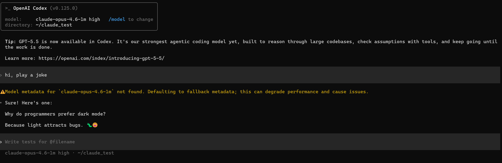
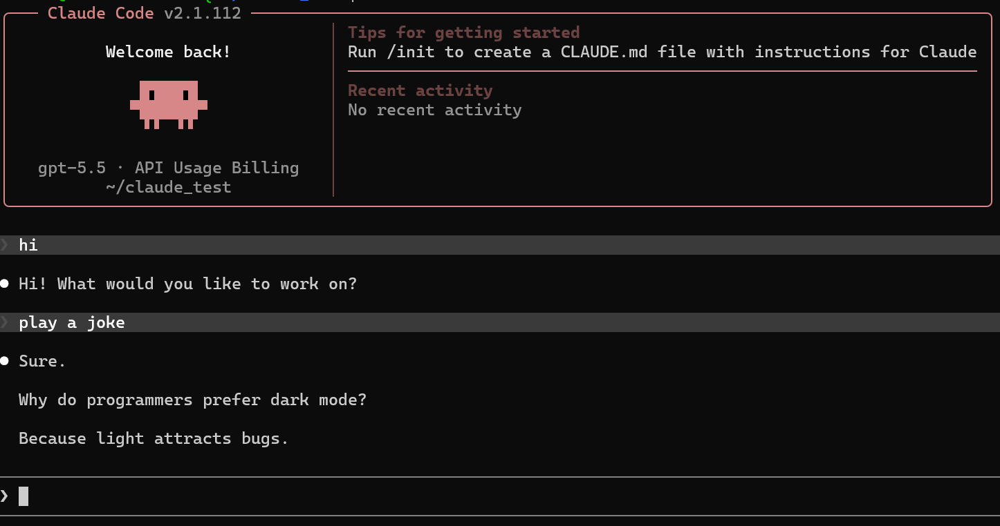

<h1 align="center">copilot-bridge</h1>

<p align="center">
  <a href="https://www.npmjs.com/package/betahi-copilot-bridge"></a>
  <a href="https://github.com/betahi/copilot-bridge/blob/main/LICENSE"></a>
</p>

> Use GitHub Copilot as a local OpenAI/Anthropic-compatible API, so [Codex CLI](https://developers.openai.com/codex/cli), [Claude Code](https://docs.anthropic.com/en/docs/claude-code/overview) and Continue can talk to Copilot with minimal configuration.

> [!CAUTION]
> This is an unofficial bridge for the GitHub Copilot API and may break if the
> upstream API changes.

## Demo

### Codex CLI



### Claude Code



## Install & run

```sh
# one-time GitHub device login
npx betahi-copilot-bridge@latest auth

# start the bridge on 127.0.0.1:4142
npx betahi-copilot-bridge@latest start
```

`start` flags: `--host`, `--port`, `--show-token`, `--debug`,
`--no-codex-setup`, `--select-model`, `--no-prompt`,
`--rate-limit <seconds>`, `--wait`.

After startup the banner prints a **Usage Viewer** link of the form
`https://betahi.github.io/copilot-bridge?endpoint=http://127.0.0.1:4142/usage`,
which renders the Copilot quota snapshot (chat / completions / premium
interactions) read from `GET /usage`.

The bridge exposes both adapter-style endpoints (`/v1/responses`,
`/v1/messages`) and the raw OpenAI-compatible surface
(`/v1/chat/completions`, `/v1/embeddings`, `/v1/models`) so tools like
LiteLLM, Continue, Cline and Aider work out of the box. CORS is enabled
globally for browser-based clients.

`--rate-limit N` enforces a minimum of N seconds between upstream
requests (anti–abuse-detection throttle). Add `--wait` to block instead
of returning HTTP 429 when the window has not elapsed.

`--debug` enables extra upstream error diagnostics in console logs.
- Includes: token limits, stream mode, tool count, invalid tool names, and suspicious tool-schema paths.
- Does not include: request messages, prompt text, bearer tokens, tool descriptions, or the full request body.

**Review or redact debug logs before sharing them publicly.**

## Configure Codex CLI

`start` writes a managed block into **`~/.codex/config.toml`**. You don't edit
between the markers; the bridge regenerates that block on every start. To pin
the **default model** for `codex` (without passing `-m` every time), add your
top-level keys above the managed block:

```toml
# User defaults; edit these freely.
model = "gpt-5.3-codex"
model_reasoning_effort = "high"

# >>> copilot-bridge managed block — auto-generated, do not edit between markers >>>
model_provider = "bridge"
model_supports_reasoning_summaries = true

[model_providers.bridge]
name = "Copilot Bridge"
base_url = "http://127.0.0.1:4142/v1"
wire_api = "responses"
prefer_websockets = false
requires_openai_auth = false
# <<< copilot-bridge managed block — edits outside this block are preserved <<<
```

Use `--no-codex-setup` to skip this writer if you manage
`~/.codex/config.toml` yourself.

### Codex warning: "Model metadata ... not found"

This is a Codex client-side metadata warning, not a bridge routing failure.
Requests can still complete through the bridge.

For 1M models, upstream still enforces a 1,000,000-token prompt
limit (about 900k succeeds; around 1,000,046 is rejected as too long).

## Configure Claude Code

Bridge endpoints: `POST /v1/messages`, `POST /v1/messages/count_tokens`.

`copilot-bridge start` automatically writes `ANTHROPIC_BASE_URL` (and a dummy
`ANTHROPIC_AUTH_TOKEN` if absent) into **`~/.claude/settings.json`**, so
`claude` works the moment the bridge is listening — even on a different host
or port. Pass `--no-claude-setup` to skip this. All other keys in your
settings file (model overrides, plugins, marketplaces) are preserved.

Minimal recommended config is:

```json
{
  "env": {
    "ANTHROPIC_BASE_URL": "http://127.0.0.1:4142",
    "ANTHROPIC_AUTH_TOKEN": "dummy",
    "ANTHROPIC_MODEL": "claude-opus-4.7",
    "MODEL_REASONING_EFFORT": "medium"
  }
}
```

For Claude Code 1M context, use the `-[1m]` display form in
`ANTHROPIC_MODEL`. Claude Code shows a 1M context window for this form, while
the bridge maps it to the real Copilot `-1m` model upstream:

```json
{
  "env": {
    "ANTHROPIC_MODEL": "claude-opus-4.7-[1m]"
  }
}
```

Optional slot-specific:

```json
{
  "env": {
    "ANTHROPIC_BASE_URL": "http://127.0.0.1:4142",
    "ANTHROPIC_AUTH_TOKEN": "dummy",
    "ANTHROPIC_MODEL": "claude-opus-4.7",
    "ANTHROPIC_DEFAULT_SONNET_MODEL": "claude-sonnet-4.6",
    "ANTHROPIC_SMALL_FAST_MODEL": "claude-haiku-4.5",
    "MODEL_REASONING_EFFORT": "medium"
  }
}
```

`MODEL_REASONING_EFFORT` (case-insensitive key lookup) is also read from the
project-local `.claude/settings.json` and `.claude/settings.local.json` and
applied to Claude requests only when the model supports reasoning. If it is not
configured, Claude requests do not infer or attach a reasoning effort.

## Environment overrides

| Variable                   | Purpose                                              |
| -------------------------- | ---------------------------------------------------- |
| `COPILOT_TOKEN`            | Pre-issued Copilot bearer token (skip device login). |
| `COPILOT_ACCOUNT_TYPE`     | `individual` \| `business` \| `enterprise`.          |
| `COPILOT_BASE_URL`         | Override the upstream Copilot base URL.              |
| `COPILOT_VSCODE_VERSION`   | Override the VS Code version sent upstream.          |
| `MODEL_REASONING_EFFORT`   | Claude-side reasoning effort override.              |

## Supported models

The bridge resolves aliases and clamps reasoning effort to what each model
accepts upstream.

### GPT-5 family — native Responses passthrough

| Model           | Reasoning efforts                        |
| --------------- | ---------------------------------------- |
| `gpt-5.5`       | `none`, `low`, `medium`, `high`, `xhigh` |
| `gpt-5.4`       | `low`, `medium`, `high`, `xhigh`         |
| `gpt-5.4-mini`  | `none`, `low`, `medium`                  |
| `gpt-5.3-codex` | `low`, `medium`, `high`, `xhigh`         |
| `gpt-5.2`       | `low`, `medium`, `high`, `xhigh`         |
| `gpt-5.2-codex` | `low`, `medium`, `high`, `xhigh`         |
| `gpt-5-mini`    | `low`, `medium`, `high`                  |

### Claude family — translated to chat completions

| Model                            | Reasoning efforts                       | Notes                                  |
| -------------------------------- | --------------------------------------- | -------------------------------------- |
| `claude-opus-4.7`                | `medium`                                | Effort sent as `output_config.effort`. |
| `claude-opus-4.7-1m`             | `low`, `medium`, `high`, `xhigh`        | 1M-token context window; effort sent as `output_config.effort`. |
| `claude-opus-4.7-high`           | `high`                                  | Fixed high reasoning; effort sent as `output_config.effort`. |
| `claude-opus-4.7-xhigh`          | `xhigh`                                 | Fixed extra-high reasoning; effort sent as `output_config.effort`. |
| `claude-opus-4.6`                | `low`, `medium`, `high`                 |                                        |
| `claude-opus-4.6-1m`             | `low`, `medium`, `high`                 | 1M-token context window.               |
| `claude-sonnet-4.6`              | `low`, `medium`, `high`                 |                                        |
| `claude-opus-4.5`                | —                                       | Reasoning not accepted upstream.       |
| `claude-sonnet-4.5`              | —                                       | Reasoning not accepted upstream.       |
| `claude-sonnet-4`                | —                                       | Reasoning not accepted upstream.       |
| `claude-haiku-4.5`               | —                                       | Reasoning not accepted upstream.       |

For Claude Opus 4.7, both Codex CLI and Claude Code can use
`claude-opus-4.7` with reasoning effort `high` or `xhigh`; the bridge routes the
request to the matching upstream reasoning variant.

For Claude Code settings, prefer `claude-opus-4.7-[1m]` or
`claude-opus-4.6-[1m]` when you want the CLI `/context` UI and the upstream
model to both use 1M context. Direct API clients can use
`claude-opus-4.7-1m` or `claude-opus-4.6-1m`.

### Gemini family — translated to chat completions

| Model                    | Aliases          |
| ------------------------ | ---------------- |
| `gemini-3.1-pro-preview` | `gemini-3.1-pro` |
| `gemini-3-flash-preview` | `gemini-3-flash` |
| `gemini-2.5-pro`         | —                |

### Legacy

`gpt-4.1`, `gpt-4o` — chat-only upstream, no reasoning parameter.

### Reasoning effort

For OpenAI-compatible clients, unsupported reasoning values are clamped to the
model capability table instead of being forwarded upstream. If a request omits
reasoning effort, the bridge leaves it omitted rather than inferring a default.
Claude-side reasoning can be set globally via `MODEL_REASONING_EFFORT` (env, or
`env` in `~/.claude/settings.json`); invalid Claude-side values are ignored,
and per-request `reasoning_effort` takes precedence.

## Development

Requires [Bun](https://bun.sh) ≥ 1.2.

```sh
bun install
bun run dev          # watch mode against src/main.ts
bun test             # run all tests (bun test runner)
bun run typecheck    # tsc --noEmit
bun run build        # produce dist/main.js with tsdown

# run directly from source (no build, no npx); --port specifies the port
bun run ./src/main.ts start --host 127.0.0.1 --port 4141 --no-prompt
```

Adding another CLI: drop a new translator under `src/bridges/<client>/`,
reuse `src/services/copilot/` for upstream calls, register routes in
`src/server.ts`, and add tests under `tests/`.

## Acknowledgements

Claude Code bridge notes inspired by
[ericc-ch/copilot-api](https://github.com/ericc-ch/copilot-api). Respect.

## License

MIT — see [LICENSE](./LICENSE).
